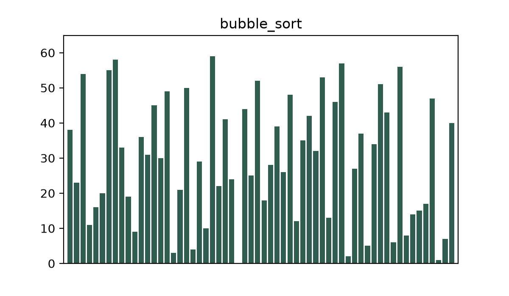
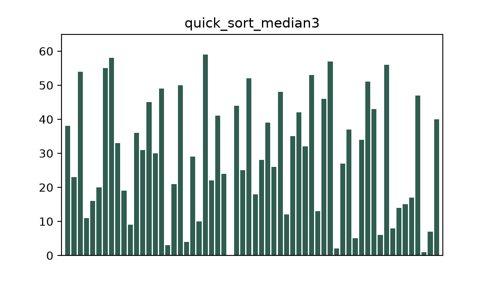
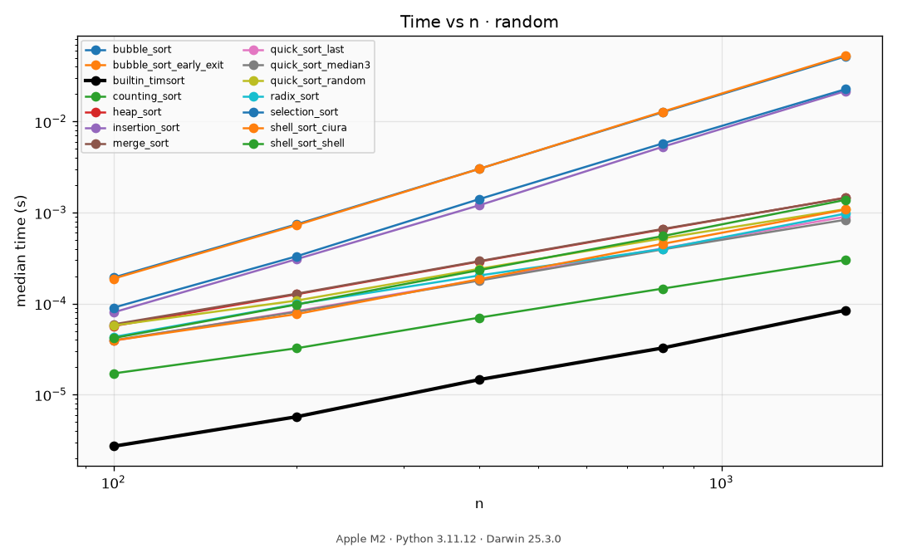
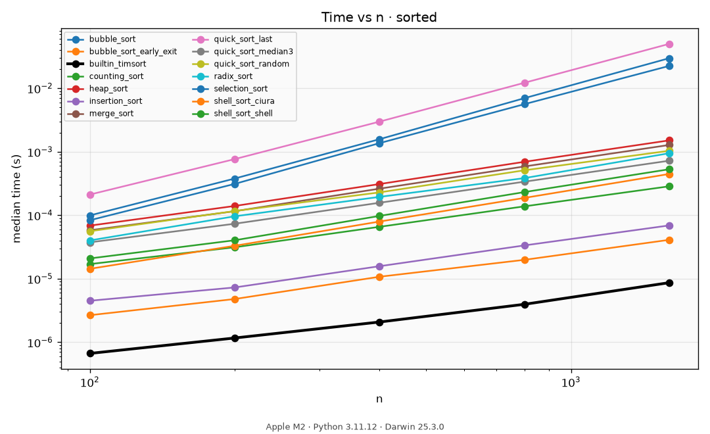
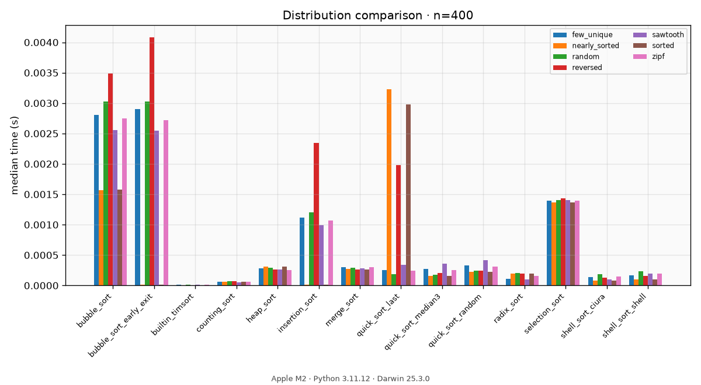
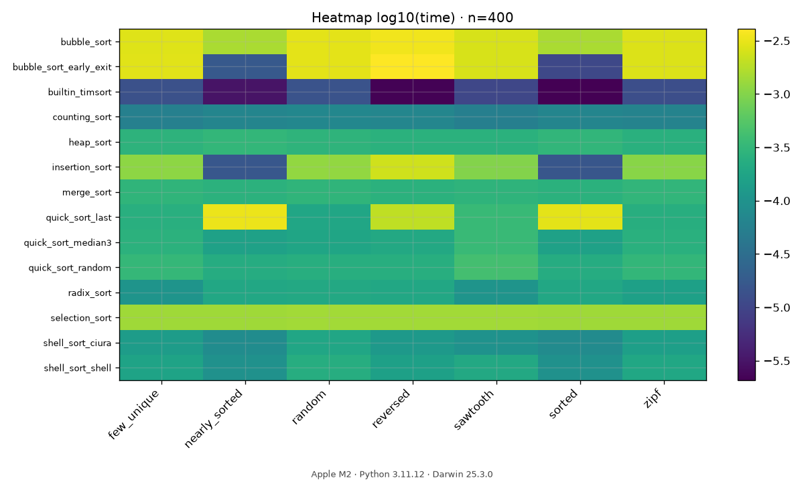
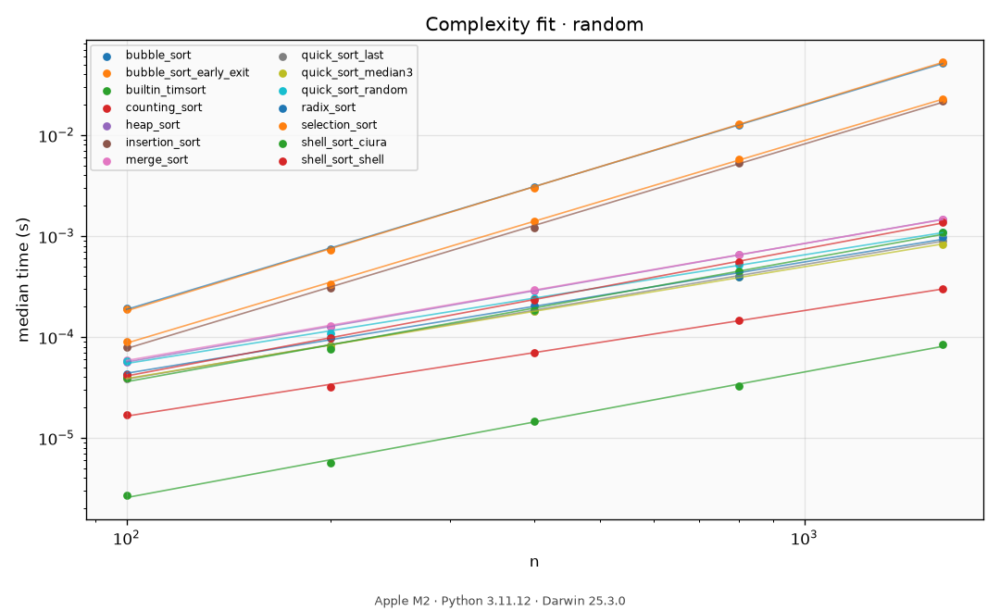
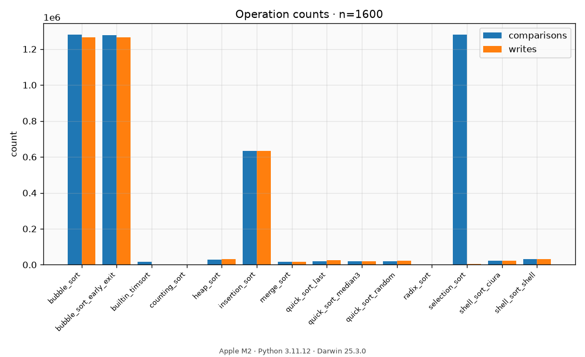
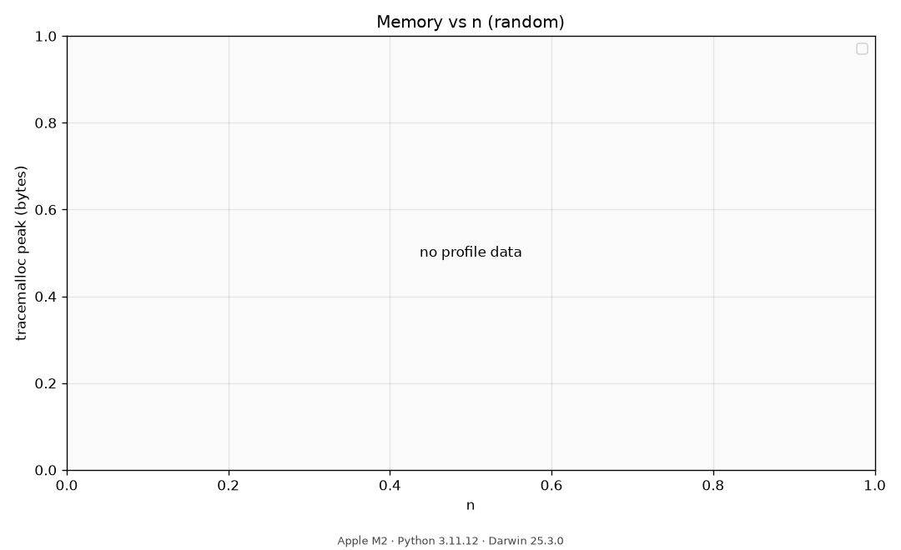

# sortlab

A measurement lab for sorting algorithms in Python: readable implementations, honest
instrumentation, and complexity you can read off a log-log plot.

<!-- sortlab:tables:start -->
### Measured exponents (random)

| Algorithm | Theory | Measured exponent | R² | Classification |
|---|---|---:|---:|---|
| `bubble_sort` | O(n^2) | 2.02 | 1.000 | ≈O(n²) |
| `bubble_sort_early_exit` | O(n^2) | 2.04 | 1.000 | ≈O(n²) |
| `builtin_timsort` | O(n log n) | 1.24 | 0.998 | ≈O(n log n) |
| `counting_sort` | O(n + k) | 1.05 | 0.999 | ≈O(n) |
| `heap_sort` | O(n log n) | 1.17 | 1.000 | ≈O(n log n) |
| `insertion_sort` | O(n^2) | 2.03 | 1.000 | ≈O(n²) |
| `merge_sort` | O(n log n) | 1.16 | 1.000 | ≈O(n log n) |
| `quick_sort_last` | O(n log n) | 1.13 | 1.000 | ≈O(n log n) |
| `quick_sort_median3` | O(n log n) | 1.11 | 1.000 | ≈O(n) |
| `quick_sort_random` | O(n log n) | 1.08 | 0.999 | ≈O(n) |
| `radix_sort` | O(n · k) | 1.10 | 0.998 | ≈O(n) |
| `selection_sort` | O(n^2) | 2.01 | 1.000 | ≈O(n²) |
| `shell_sort_ciura` | O(n^1.25) | 1.21 | 0.997 | ≈O(n log n) |
| `shell_sort_shell` | O(n^1.5) | 1.26 | 1.000 | ≈O(n log n) |

_Skipped/timeout rows in matrix: 0_
<!-- sortlab:tables:end -->

## Animations

Each GIF shows one algorithm sorting a random array (`n=60`). Frames are captured from
write events in `TrackedList` — no algorithm code was changed for visualization.

| Algorithm | What you see |
|---|---|
| **Bubble sort** | Adjacent swaps ripple large values to the right, pass by pass. |
| **Insertion sort** | Growing sorted prefix; each new key slides left into place. |
| **Quick sort (median-of-3)** | Partition pivots split the range; subranges sort independently. |
| **Merge sort** | Halves are sorted, then merged into longer sorted runs. |

| bubble | insertion | quick (median-of-3) | merge |
|---|---|---|---|
|  |  |  |  |

*Files: `docs/animations/*.gif`*

## Charts

Raw numbers live in `benchmarks/results/latest.json`. Every PNG is also stamped with CPU
model and Python version in the figure footer.

### Time vs n (random) — log-log growth

Median runtime vs input size on random data. Slope ≈ empirical complexity.
`builtin_timsort` is the thick black reference line.



### Time vs n (sorted) — pivot disaster

Same plot on already-sorted input. `quick_sort_last` blows up toward O(n²); adaptive
sorts (insertion, early-exit bubble, Timsort) stay flat/cheap.



### Distribution comparison — same n, different shapes

Bar chart: one fixed `n`, every input distribution side by side. Shows that “faster
algorithm” depends on the data shape, not only on Big-O labels.



### Heatmap — algorithm × distribution

Darker/lighter cells = log₁₀(median time) at a representative `n`. Quick scan of which
pairs are cheap or expensive.



### Complexity fit — measured power law

Scatter of measured points plus fitted `t ∝ n^a` curves on random data. This is the
README’s main claim made visual.



### Operation counts — comparisons vs writes

Counted operations (instrumentation mode), not wall time. Selection shows many
comparisons / few writes; bubble shows huge write counts.



### Memory — merge vs in-place sorts

`tracemalloc` peak vs `n` for `merge_sort`, `heap_sort`, and `quick_sort_median3`.
Merge grows with `n`; the in-place sorts do not.



*Files: `docs/charts/*.png`*

## Findings

Numbers below come from `benchmarks/results/latest.json` on this machine
(see chart captions for CPU / Python).

1. **Insertion sort beats quicksort on nearly sorted input across the whole measured
   range.** At every `n` from 200 to 3200, `insertion_sort` on `nearly_sorted` finished
   in about **9–15%** of the time of `quick_sort_median3` (e.g. n=3200: 0.144 ms vs
   1.59 ms). There is no crossover in this window — “O(n²) is always worse” is false
   for adaptive quadratic sorts.

2. **A naive pivot turns quicksort into quadratic work on sorted data.**
   `quick_sort_last` on `sorted` vs `random` slows down by **9.5× at n=200**, **54× at
   n=1600**, and **99× at n=3200** (0.212 s vs 0.0021 s). Same algorithm, same `n`,
   different input shape.

3. **Comparisons and writes are different metrics.** On random n=3200, `selection_sort`
   performed **5,118,400** comparisons but only **6,384** writes; `bubble_sort` wrote
   about **5.18 million** times. Selection is still slow — it just proves the counters
   measure separate things.

4. **Radix sort breaks the comparison-sort story.** On random n=3200, `radix_sort`
   measured exponent **1.08** with **0 comparisons** in the counting mode (bucket work
   only), while comparison sorts sit on Ω(n log n). The cost is the integer-key
   assumption and extra memory.

5. **CPython’s Timsort is still far ahead.** On random n=3200, `builtin_timsort`
   took **0.212 ms**; the best pure-Python entry (`counting_sort`) was ~**3×** slower,
   and `quick_sort_median3` ~**9×** slower. The gap is the interpreter, not the idea.

## Run it

```bash
python -m venv .venv
source .venv/bin/activate
pip install -e ".[dev]"

sortlab list
sortlab bench                          # writes benchmarks/results/latest.json
sortlab report                         # charts + README tables
sortlab animate --algorithm merge_sort
sortlab dataset --rows 200000 -o data/records.csv
```

## Add your own algorithm

Create `src/sortlab/algorithms/<name>/` with `algorithm.py`, `__init__.py`, and a Polish
`README.md`, then decorate the function with `@register(...)`. No other files need editing —
discovery and the shared test suite pick it up automatically.

## Measurement methodology

- **Timing mode:** raw `int` values, fresh copy per repeat, one discarded warmup,
  `gc.disable()` during measurement, `time.perf_counter()`, reported **median**.
- **Counting mode:** `TrackedList` + `Tracked` values. Never mixed with timing.
- **Guards:** `max_n` skips and hard timeouts stay in the result matrix as skipped rows.
- **Limits (stated honestly):** CPU noise on short runs; RSS sampling only kept for
  runs ≥ 0.5 s; results are from one machine; `builtin_timsort` comparisons happen in C
  and are **not** visible to `Tracked`.

## Architecture

Algorithms never import the measurement layer. Dependencies point one way:
`algorithms → registry → types`, while `bench` / `instrument` / `report` read the
registry. An algorithm that knows it is being measured stops being an honest object of
measurement.

---

## License

[MIT](LICENSE) — Copyright (c) 2026 Wojciech Wypych (Iakirmon).

---

## Po polsku

**sortlab** to laboratorium pomiarowe algorytmów sortowania w Pythonie: czytelne
implementacje, uczciwa instrumentacja i złożoność odczytywana z wykresu log-log.

### Animacje

Każdy GIF pokazuje jeden algorytm na losowej tablicy (`n=60`). Klatki zbierane są z
zapisów w `TrackedList` — w algorytmach nie ma żadnego kodu „pod animację”.

| Algorytm | Co widać |
|---|---|
| **Bubble sort** | Zamiany sąsiadów wypychają duże wartości w prawo, przebieg po przebiegu. |
| **Insertion sort** | Rośnie posortowany prefiks; nowy element wsuwa się w lewo na swoje miejsce. |
| **Quick sort (mediana z 3)** | Pivot dzieli zakres; podzakresy sortują się osobno. |
| **Merge sort** | Połówki są sortowane, potem scalane w dłuższe posortowane biegi. |

| bubble | insertion | quick (mediana z 3) | merge |
|---|---|---|---|
|  |  |  |  |

*Pliki: `docs/animations/*.gif`*

### Wykresy

Surowe liczby: `benchmarks/results/latest.json`. Na każdym PNG w stopce są model CPU
i wersja Pythona.

#### Czas vs n (random) — wzrost log-log

Mediana czasu względem rozmiaru na danych losowych. Nachylenie ≈ zmierzona złożoność.
`builtin_timsort` to gruba czarna linia odniesienia.


#### Czas vs n (sorted) — katastrofa pivota

Ten sam wykres na już posortowanym wejściu. `quick_sort_last` idzie w stronę O(n²);
sortowania adaptacyjne (insertion, bubble z early exit, Timsort) zostają tanie.


#### Porównanie rozkładów — to samo n, inne kształty

Słupki: ustalone `n`, obok siebie wszystkie rozkłady wejścia. Pokazuje, że „szybszy
algorytm” zależy od kształtu danych, nie tylko od etykiety Big-O.


#### Mapa cieplna — algorytm × rozkład

Komórki = log₁₀(mediana czasu) przy reprezentatywnym `n`. Szybki przegląd tanich
i drogich par.


#### Dopasowanie złożoności — zmierzona potęga

Punkty pomiarowe + dopasowane krzywe `t ∝ n^a` na random. To wizualna teza README.


#### Liczniki operacji — porównania vs zapisy

Operacje z trybu liczenia (nie czas ścienny). Selection: dużo porównań / mało zapisów;
bubble: ogromna liczba zapisów.


#### Pamięć — merge vs sortowania in-place

Szczyt `tracemalloc` względem `n` dla `merge_sort`, `heap_sort` i `quick_sort_median3`.
Merge rośnie z `n`; warianty in-place nie.


*Pliki: `docs/charts/*.png`*

### Wnioski

Liczby pochodzą z `benchmarks/results/latest.json` (model CPU i wersja Pythona są
na podpisach wykresów).

1. **Insertion sort wygrywa z quicksortem na prawie posortowanych danych** w całym
   mierzonym zakresie. Dla każdego `n` od 200 do 3200 `insertion_sort` na
   `nearly_sorted` zajmował ok. **9–15%** czasu `quick_sort_median3` (np. n=3200:
   0,144 ms vs 1,59 ms). W tym oknie nie ma punktu przecięcia — „O(n²) zawsze jest
   gorsze” nie dotyczy adaptacyjnych sortowań kwadratowych.

2. **Naiwny pivot psuje quicksort na posortowanym wejściu.** `quick_sort_last` na
   `sorted` vs `random` zwalnia **9,5× przy n=200**, **54× przy n=1600** i **99× przy
   n=3200** (0,212 s vs 0,0021 s). Ten sam algorytm, to samo `n`, inny kształt danych.

3. **Porównania i zapisy to osobne metryki.** Na random n=3200 `selection_sort` zrobił
   **5 118 400** porównań, ale tylko **6384** zapisy; `bubble_sort` zapisał ok.
   **5,18 mln** razy. Selection i tak jest wolny — liczniki po prostu mierzą coś innego.

4. **Radix sort przełamuje narrację o sortowaniu przez porównania.** Na random n=3200
   zmierzony wykładnik ≈ **1,08**, a w trybie liczenia **0 porównań** (sama praca na
   kubełkach). Koszt: założenie o kluczach całkowitych i dodatkowa pamięć.

5. **Wbudowany Timsort nadal jest daleko z przodu.** Na random n=3200
   `builtin_timsort` zajął **0,212 ms**; najlepszy czysty Python (`counting_sort`) był
   ok. **3×** wolniejszy, a `quick_sort_median3` ok. **9×**. Różnica to interpreter,
   nie sam pomysł algorytmu.

### Uruchomienie

```bash
python -m venv .venv
source .venv/bin/activate
pip install -e ".[dev]"

sortlab list
sortlab bench                          # zapisuje benchmarks/results/latest.json
sortlab report                         # wykresy + tabele w README
sortlab animate --algorithm merge_sort
sortlab dataset --rows 200000 -o data/records.csv
```

### Jak dodać własny algorytm

Utwórz `src/sortlab/algorithms/<nazwa>/` z `algorithm.py`, `__init__.py` i polskim
`README.md`, potem udekoruj funkcję `@register(...)`. Reszty plików nie trzeba
edytować — discovery i wspólny zestaw testów łapią nowy wpis same.

### Metodologia pomiaru

- **Tryb czasu:** surowe `int`, świeża kopia na każde powtórzenie, jeden przebieg
  rozgrzewkowy odrzucany, `gc.disable()` na czas pomiaru, `time.perf_counter()`,
  raportowana **mediana**.
- **Tryb liczenia:** `TrackedList` + `Tracked`. Nigdy nie mieszany z pomiarem czasu.
- **Bezpieczniki:** pominięcia `max_n` i timeouty zostają w macierzy wyników jako
  pominięte wiersze.
- **Ograniczenia (uczciwie):** szum CPU na krótkich przebiegach; próbkowanie RSS tylko
  dla przebiegów ≥ 0,5 s; wyniki z jednej maszyny; porównania `builtin_timsort`
  dzieją się w C i **nie** są widoczne dla `Tracked`.

### Architektura

Algorytmy nie importują warstwy pomiarowej. Zależności idą w jedną stronę:
`algorithms → registry → types`, a `bench` / `instrument` / `report` czytają rejestr.
Algorytm, który wie, że jest mierzony, przestaje być uczciwym obiektem pomiaru.

### Licencja

[MIT](LICENSE) — Copyright (c) 2026 Wojciech Wypych (Iakirmon).
